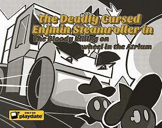

# The Deadly Cursed Enjmin Steamroller
Created in **48H** for the **ENJMAN 2022**

You're playing a cursed steamroller that must kill cultists to summon the demon that cursed you.

A demon cursed you into being a steam-werewolf-roller. In order to get your human form back, you have to roll over their minions, suck their blood in and paint the demonic symbol on the ground with it. 

Available on [itch.io](https://railnof.itch.io/the-deadly-cursed-enjmin-steamroller)

## Team
- [Marie Pakula](https://mariecajou.itch.io/) (Game Design, Narrative Design), 
- [Jules Poulain](https://bigaston.itch.io/) (Programming, Visual Novel part), 
- [Dorian Vabre](https://leaping.itch.io/) (Programming, Gameplay, Game graphics),
- [Sam Chevrin](https://railnof.itch.io/) (Sound Design, Ergonomy).

Special thanks to [Lauralie Girard](http://linfusion.itch.io/) (cover art), [Charles Vincent](http://fruitc4ke.itch.io/) (in-game character) & [Tom Nouet](https://shertigan.itch.io/) (music).